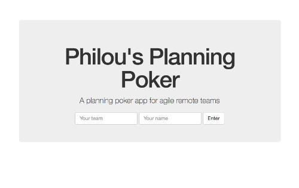
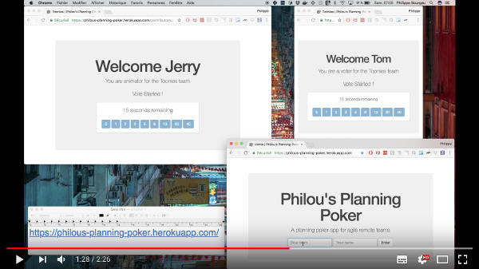

# Planning-Poker


[](https://codeclimate.com/github/philou/planning-poker)
[](https://codeclimate.com/github/philou/planning-poker/coverage)
[](https://codeclimate.com/github/philou/planning-poker) [](https://philous-planning-poker.herokuapp.com/)

An app to enable agile teams to do effective remote [Planning Poker](https://en.wikipedia.org/wiki/Planning_poker) estimations.

[](https://philous-planning-poker.herokuapp.com/)

## Why

During my career as a software engineer, I am more and more working in teams that span over many places. At the same time, I am a great proponent of the agile way which favor co-located teams.

I am convinced that teams can be both remote *and* agile. Provided they have the correct tools.

This app enables remote teams to run effective [poker planning](https://en.wikipedia.org/wiki/Planning_poker) sessions. Without it, they would use a video conference to share their estimates through the camera. With this app, a phone call is enough.

In the long run, it could improve the estimation experience for both remote and co-located teams :

* It could warn of a "risky" or "unlikely" estimations, by analyzing the distribution
* It help to do "Risk" estimations, which have 2 axes (likelihood and criticality)

## How to use it

### Tutorial

To do a remote planning poker session, you'll all need 3 things :

* an internet connection
* be together in a voice teleconference
* know what [poker estimation technique](https://en.wikipedia.org/wiki/Planning_poker)

Once this is ready, you should all go to [https://philous-planning-poker.herokuapp.com/](https://philous-planning-poker.herokuapp.com/).

1. Type in your team name and pseudo, and enter your team space. The first to enter becomes the animator for the team.
2. Discuss together about what you are going to estimate.
3. The animator starts a vote.
4. Everyone estimates the task in [story points](https://www.mountaingoatsoftware.com/blog/what-are-story-points).
5. At the end of the vote, you should all see the distribution of the estimates.
6. Discuss the results.
7. At any moment, the animator can start a new vote.

Here is a video demonstrating how the different contributors interact :

[](https://www.youtube.com/watch?v=yUTpabukwxE)

### FAQ

> What if no one is the animator ?

You must have entered a team space that is already used and which already has an animator. Pick another team name to fix that.

> I entered my team name and pseudo, but it seems I am alone !

You must have used a different team name. The tool is case sensitive, be sure to use exactly the same team name.

### Limitations

Here are the main current limitations of the tool :

* The animator is the first person in the team to log in, once someone is animator for a team, he cannot back out of this role
* Each vote lasts for 30 seconds, even if everyone has voted
* The only form of authentication are the team and persons names, this can lead to conflicts
* The tool is not built to scale, new teams and contributors pill up in a Postgres DB but are not garbage collected.
* The main instance runs on a free [Heroku](https://www.heroku.com/) app

Anyone could fix these if needed.

### Feedback is welcome

I'd appreciate your feedback about this tool. Whether

* to tell me what you think of it
* to explain what you'd need before to start using it
* to ask any question

Contact me or create a [Github issue](https://github.com/philou/planning-poker/issues).

## Open Source

The tool is open source, under the [Apache License 2.0](https://www.apache.org/licenses/LICENSE-2.0). Among other things, this means that :

* you can install it on your own server and run your own instance
* you can contribute improvement to it

Check the [source code on Github](https://github.com/philou/planning-poker) to learn how to do this.

## How to run it

### Heroku

The app is continuously deployed to [Heroku](https://www.heroku.com) at https://philous-planning-poker.herokuapp.com/.

Deploying to your own Heroku app is straightforward. It only requires an SQL DB and a Redis server. Here is the way to go :

```bash
# install the Heroku command line
brew install heroku

# clone the repo
git clone git@github.com:philou/planning-poker.git
cd planning-poker

# create an Heroku app
heroku apps:create

# add a Postgres DB
heroku addons:create heroku-postgresql:hobby-dev

# add Redis
heroku addons:create heroku-redis:hobby-dev

# deploy
git push heroku master

# migrate your database
heroku run rake db:migrate
```

Your app should be running in the cloud !

### Local machine

Deploying on a local machine or server is pretty simple too. 

#### Pre-requisite

You need to have a few things installed first :

* [Ruby](https://www.ruby-lang.org), I use [rbenv](https://github.com/rbenv/rbenv) for that
* [Docker](https://www.docker.com/)
* [PhantomJS](http://phantomjs.org/) if you want to run the tests

#### Sources

Then, clone the repo :

```
git clone https://github.com/philou/planning-poker.git
cd planning-poker
```

#### Dependencies

They are managed with bundler. Just run the following :

```
bundle install
```

bundle might complain that some dependencies are missing on your OS, in this case follow its advices and install them.

#### Database

There is a docker compose configuration to start services dependencies. You can either use docker, or start these services yourself. Here is the docker way.

You'll need to have docker and docker compose installed :

* https://docs.docker.com/engine/installation/
* https://docs.docker.com/compose/install/

Then, run the following to create the database :

```
docker-compose up
bundle exec rake db:create
bundle exec rake db:migrate
```

#### Local run

The db should be started from previous step. Start the rails server the typical way

```
bundle exec bin/rails server
```

Check that it's running at http://localhost:3000

## How to contribute

### Issues

Issues and user stories are maintained in the [github issues](https://github.com/philou/planning-poker/issues) of this repo. [ZenHub](https://www.zenhub.com/) is a nice addition to visualize and prioritize the tasks to work on.

### Continuous Delivery Chain

There is a [TravisCI Job](https://travis-ci.org/philou/planning-poker) continuously building any change on the github repo. When the build passes, the app is automatically deployed to [Heroku](https://philous-planning-poker.herokuapp.com/).

The repo is also linked to a [Code Climate project](https://codeclimate.com/github/philou/planning-poker) which performs static code analysis and monitors code issues.

### Coding Conventions

Here are the few guidelines I followed when building the initial version of this app

* Stick to the standards : Code Climate is very good at pointing out any infringement to this rule
* Do the simplest thing that could work. I did not build complex stuff when more down to earth solutions work perfectly in the current setting
* Update the dependencies as often as possible. As the whole code is automatically tested, it's a lot easier to stay on the latest versions.
* Test Driven Development is key in allowing Continuous Delivery
* As few mocks as possible. Mocks are brittle, difficult to maintain and provide a false sense of security
* I tracked technical debt (the things I decided not to do now) using #TODO comments, which appear in Code Climate

## Authors

* [Philippe Bourgau](http://philippe.bourgau.net)
